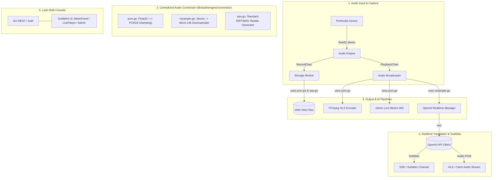

```mermaid
flowchart TB
  subgraph Input ["1. Audio Input & Capture"]
    HW[PortAudio Device] -->|float32 stereo| ENG[Audio Engine]
    ENG -->|RecordChan| STORAGE[Storage Worker]
    ENG -->|PlaybackChan| BCAST[Audio Broadcaster]
  end

  subgraph Conversion ["2. Centralized Audio Conversion (lib/audioengine/conversion)"]
    direction TB
    PCM["pcm.go: Float32 <-> PCM16 (clamping)"]
    RESAMPLE["resample.go: Stereo -> Mono 24k Downsampler"]
    WAV["wav.go: Standard RIFF/WAV Header Generator"]
  end

  subgraph Processing ["3. Output & AI Pipelines"]
    STORAGE -->|uses pcm.go & wav.go| DISK[(WAV Disk Files)]
    BCAST -->|uses pcm.go| HLS[FFmpeg HLS Encoder]
    BCAST -->|uses pcm.go| WS[Admin Live Meters WS]
    BCAST -->|uses resample.go| AI[OpenAI Realtime Manager]
  end

  subgraph AI_Streams ["4. Realtime Translation & Subtitles"]
    AI -->|wss| OAI_WS[(OpenAI API 24kHz)]
    OAI_WS -->|Subtitles| SSE[SSE / Subtitles Channel]
    OAI_WS -->|Audio PCM| STREAM[HLS / Client Audio Stream]
  end

  subgraph Frontend ["5. Lean Web Console"]
    API[Gin REST / Auth] --- UI[SvelteKit UI: MeterPanel / LivePlayer / Admin]
  end
```
