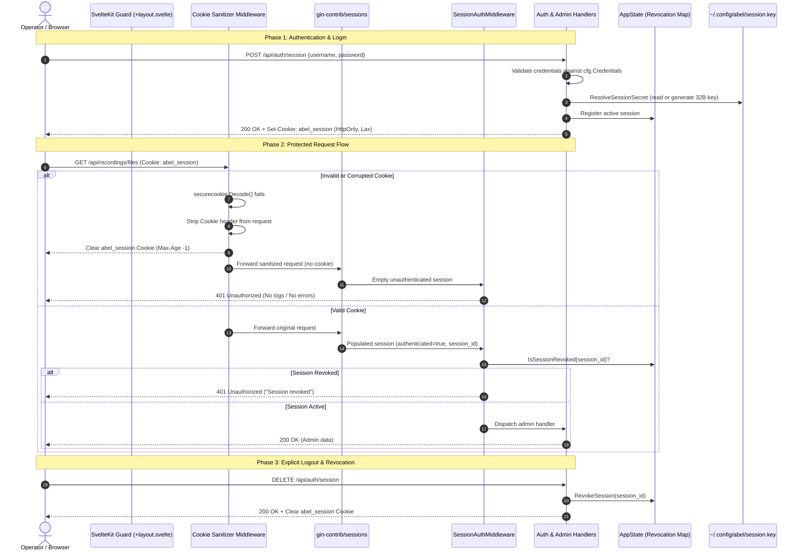

# Comprehensive Architecture & Audit Guide: Abel Authentication System

> **Scope**: End-to-end architectural specification, data invariants, cryptographic security boundaries, lifecycle mechanics, and audit playbooks for the Abel authentication and session management subsystems.

---

## 1. Executive Summary & Architecture

The Abel authentication subsystem provides role-based administrative control over sensitive audio engine parameters, recording management, AI streaming toggles, and system configuration. It implements defence-in-depth across the cryptographic key store, transport security, HTTP middleware, server-side revocation state, and client-side route guards.



---

## 2. Authentication Subsystems & Key Invariants

### Subsystem 1: Credentials Management & Resolution

#### Implementation
- [`config.go`](file:///home/samuelmoses/Workspace/Church/Abel-Audio-Utils/src/backend/lib/config/config.go#L80-L125): `LoadCredentials(configPath, credsPath string) map[string]string`

#### Mechanics
1. **Configured Source**: `admin_user_credentials` defined in `~/.config/abel/config.yaml`.
2. **Relative Path Resolution**: Uses `ResolveRelativePath()` to resolve paths relative to `config.yaml` directory before falling back to the process working directory.
3. **Format Compatibility**: Automatically parses both JSON array format (`[{"username": "...", "password": "..."}]`) and dictionary format (`{"admin": "..."}`).
4. **Zero-Lockout Fallback**: If no credentials file is specified or the file is missing/unreadable, the system automatically injects default credentials (`admin:admin`). This guarantees an operator is never locked out of a newly installed instance.

---

### Subsystem 2: Cryptographic Secret Key Lifecycle

#### Implementation
- [`config.go`](file:///home/samuelmoses/Workspace/Church/Abel-Audio-Utils/src/backend/lib/config/config.go#L125-L165): `ResolveSessionSecret(cfg *Config) ([]byte, error)`

#### Resolution Priority Hierarchy
1. **Explicit Config Override**: If `cfg.SessionSecret` (or `SESSION_SECRET` environment variable) is non-empty, its bytes are used directly.
2. **Persistent Disk Key**: Checks for `session.key` in the configuration directory (`filepath.Dir(cfg.Path)` or `~/.config/abel/session.key`). If present and non-empty, the key is reused.
3. **Cryptographic Generation**: If `session.key` is missing:
   - Generates 32 cryptographically secure random bytes via `crypto/rand.Read`.
   - Creates the directory with mode `0700`.
   - Persists the secret to `session.key` with strict POSIX permissions `0600` (read/write only by the process owner).

#### Invariants
- **Multi-Run Persistence**: Browser sessions survive normal server restarts because the secret key is stable on disk.
- **Strict File Permissions**: The key file is restricted to owner permissions `0600`, preventing local unauthorized users from reading session signing secrets.

---

### Subsystem 3: Pre-Validation Cookie Sanitizer Middleware

#### Implementation
- [`handlers_auth.go`](file:///home/samuelmoses/Workspace/Church/Abel-Audio-Utils/src/backend/lib/web/handlers_auth.go#L155-L180): `CookieSanitizerMiddleware(cookieName string, sessionSecret []byte) gin.HandlerFunc`
- [`router.go`](file:///home/samuelmoses/Workspace/Church/Abel-Audio-Utils/src/backend/lib/web/router.go#L68-L72): Registered immediately prior to `sessions.Sessions()`

#### Mechanics
Third-party session libraries (`gin-contrib/sessions` on top of `gorilla/sessions`) unconditionally log `slog.Error("[sessions] ERROR!", "err", err)` whenever an invalid, rotated, or corrupted cookie is received from a client. 

To eliminate this without altering telemetry log pipelines:
1. `CookieSanitizerMiddleware` intercepts incoming HTTP requests.
2. If `abel_session` cookie is present, it tests decoding using `securecookie.New(sessionSecret, nil).Decode()`.
3. If signature verification fails (e.g. after key rotation, manual cookie tampering, or expired timestamp):
   - It strips `abel_session` from `c.Request.Header["Cookie"]`.
   - It appends `Set-Cookie: abel_session=; Path=/; Max-Age=0; HttpOnly` to the response headers.
4. When `gin-contrib/sessions` executes, it sees a request without a cookie, initializes a clean unauthenticated session, and logs zero errors.
5. The browser deletes the stale cookie immediately upon receiving the response.

---

### Subsystem 4: Session Cookies & Transport Policy

#### Cookie Configuration ([`router.go`](file:///home/samuelmoses/Workspace/Church/Abel-Audio-Utils/src/backend/lib/web/router.go#L60-L68))
- **Cookie Name**: `abel_session`
- **Store**: `cookie.NewStore(sessionSecret)`
- **Path**: `/`
- **MaxAge**: `604800` (7 days)
- **HttpOnly**: `true` (prevents JavaScript access via `document.cookie`, mitigating XSS credential theft)
- **SameSite**: `http.SameSiteLaxMode` (mitigates Cross-Site Request Forgery while allowing standard top-level navigation)
- **Secure**: `false` by default (enables local network IP/HTTP deployments; can be toggled to `true` behind reverse proxies terminating HTTPS)

---

### Subsystem 5: Session Handlers & Endpoints

| Method | Endpoint | Handler | Access | Purpose |
| :--- | :--- | :--- | :--- | :--- |
| `POST` | `/api/auth/session` | `LoginHandler` | Public | Authenticates credentials, creates session, generates session ID |
| `GET` | `/api/auth/session` | `GetSessionHandler` | Protected | Returns current authenticated user and session ID |
| `DELETE` | `/api/auth/session` | `LogoutHandler` | Public / Authed | Revokes session ID server-side and clears client cookies |

#### Login Routine (`LoginHandler`)
1. Parses JSON payload (`{"username": "...", "password": "..."}`). Defaults username to `"admin"` if omitted.
2. Validates credentials against `cfg.Credentials`.
3. Generates a 16-byte random session ID (`crypto/rand.Read` formatted as 32 hex chars).
4. Stores `authenticated: true`, `session_id: <hex>`, and `username: <name>` in the session store.
5. Saves the signed cookie to the client and responds with `{"status": "success", "session": "<hex>"}`.

#### Logout Routine (`LogoutHandler`)
1. Extracts `session_id` from the current session.
2. Calls `appState.RevokeSession(sessionID)` to add the ID to the in-memory revocation blacklist.
3. Clears session data (`session.Clear()`) and sets cookie `MaxAge: -1`.
4. Emits `Set-Cookie: abel_session=; Path=/; Max-Age=-1`.

---

### Subsystem 6: Route Protection & Server-Side Revocation

#### Implementation
- [`handlers_auth.go`](file:///home/samuelmoses/Workspace/Church/Abel-Audio-Utils/src/backend/lib/web/handlers_auth.go#L127-L153): `SessionAuthMiddleware(appState *state.AppState)`
- [`state/app_state.go`](file:///home/samuelmoses/Workspace/Church/Abel-Audio-Utils/src/backend/lib/state/engine.go): `RevokeSession(id)` and `IsSessionRevoked(id)`

#### Protected Endpoints ([`RegisterAdminRoutes`](file:///home/samuelmoses/Workspace/Church/Abel-Audio-Utils/src/backend/lib/web/router.go#L140-L160))
All mutating and administrative routes are gated behind `SessionAuthMiddleware`:
- `PATCH /api/audio/config`: Audio hardware routing and boost levels
- `POST /api/audio/restart`: Hardware restart orchestration
- `POST /api/recordings`: Recording start and stop commands
- `POST /api/ai/streams`: Per-language translation master and killswitch toggles
- `GET /api/recordings/files`: Raw recording file listings
- `GET /api/recordings/library`: Normalized and trimmed recording metadata
- `POST /api/recordings/upload`: Audio importing
- `POST /api/recordings/process`: FFmpeg loudness normalization and trimming
- `POST /api/recordings/process/cancel`: Post-processing cancellation
- `POST /api/recordings/push`: Cloud delivery pipeline
- `GET /api/system/changelog`: System release changelog
- `/recordings/raw/*`: Static direct access to raw recording WAV files

#### Dual-Check Validation
1. **Authentication Flag**: `session.Get("authenticated") == true`. If missing or false, returns `401 Unauthorized` with `{"error": "Unauthorized session"}`.
2. **Server-Side Revocation Check**: `appState.IsSessionRevoked(sessionID)`. If true, returns `401 Unauthorized` with `{"error": "Session revoked"}`. This prevents replay attacks if an attacker obtained an old cookie before logout.

---

### Subsystem 7: Client-Side Route Protection & Layout Guards

#### Implementation
- SvelteKit Layout Guard: [`src/frontend/src/routes/admin/+layout.svelte`](file:///home/samuelmoses/Workspace/Church/Abel-Audio-Utils/src/frontend/src/routes/admin/+layout.svelte)
- Redirect Sanitizer: [`src/frontend/src/lib/utils/redirect.ts`](file:///home/samuelmoses/Workspace/Church/Abel-Audio-Utils/src/frontend/src/lib/utils/redirect.ts)

#### Mechanics
1. On mounting any route under `/admin/*`, `+layout.svelte` executes a reactive fetch to `GET /api/auth/session`.
2. If the API returns a status other than 200 (or if network failure occurs), the layout stops rendering admin controls and invokes `goto("/login?returnTo=" + encodeURIComponent(currentPath))`.
3. Upon successful login at `/login`, `redirect.ts` validates `returnTo` using `sanitizeReturnUrl(url)`.
   - Rejects URLs starting with `//` (protocol-relative phishing redirects).
   - Rejects non-relative paths (e.g. `https://evil.com`).
   - Ensures redirects only lead back to local endpoints such as `/admin`.

---

### Subsystem 8: WebSocket Administrative Concurrency Control

#### Implementation
- [`ws.go`](file:///home/samuelmoses/Workspace/Church/Abel-Audio-Utils/src/backend/lib/web/ws.go#L20-L50)

#### Mechanics
1. When a client opens `GET /ws`, the handler inspects `abel_session`.
2. If `authenticated == true`, the client is flagged as an administrative client.
3. The server enforces a single-active-admin lock (`activeAdminMu` / `appState.AcquireAdminLock()`):
   - Only one admin session can hold write privileges at a time.
   - When the active admin disconnects, the lock is released cleanly and logged via `slog`.

---

## 3. Threat Model & Security Mitigations

| Threat Vector | Mitigation Strategy | Implementation |
| :--- | :--- | :--- |
| **XSS Cookie Theft** | `HttpOnly: true` on session cookies prevents DOM JavaScript access via `document.cookie`. | [`router.go`](file:///home/samuelmoses/Workspace/Church/Abel-Audio-Utils/src/backend/lib/web/router.go#L64) |
| **Cross-Site Request Forgery (CSRF)** | `SameSite: Lax` prevents cross-site POST/PATCH requests from sending cookies. | [`router.go`](file:///home/samuelmoses/Workspace/Church/Abel-Audio-Utils/src/backend/lib/web/router.go#L66) |
| **Session Replay After Logout** | Server-side revocation blacklist in `AppState` rejects cookies even if expiration timestamp has not elapsed. | [`handlers_auth.go`](file:///home/samuelmoses/Workspace/Church/Abel-Audio-Utils/src/backend/lib/web/handlers_auth.go#L140-L148) |
| **Secret Key Leakage** | POSIX permissions `0600` on `session.key` prevent other local system accounts from reading cryptographic keys. | [`config.go`](file:///home/samuelmoses/Workspace/Church/Abel-Audio-Utils/src/backend/lib/config/config.go#L155) |
| **Open Redirect Attacks** | `sanitizeReturnUrl()` restricts redirection to leading `/` paths, preventing external domain redirects. | [`redirect.ts`](file:///home/samuelmoses/Workspace/Church/Abel-Audio-Utils/src/frontend/src/lib/utils/redirect.ts#L10) |
| **Third-Party Noise / Error Spam** | `CookieSanitizerMiddleware` strips expired or rotated cookies before `gin-contrib/sessions` processes them. | [`handlers_auth.go`](file:///home/samuelmoses/Workspace/Church/Abel-Audio-Utils/src/backend/lib/web/handlers_auth.go#L155-L180) |

---

## 4. Verification Playbook & Test Suites

### Automated Backend Test Verification
Run the complete auth and configuration test suites:
```bash
go test -v ./src/backend/lib/web -run "TestLoginHandler|TestGetSessionHandler|TestAdminRoutesProtection|TestSessionSecretValidation|TestLogoutHandlerAndRevocation|TestCookieSanitizerMiddleware"
go test -v ./src/backend/lib/config -run "TestLoadCredentials|TestResolveSessionSecret"
```

### Automated Frontend Test Verification
Run the redirect utility and admin layout tests:
```bash
cd src/frontend && bun run test:unit src/lib/utils/redirect.test.ts src/routes/admin/admin.test.ts
```

### Manual Audit Verification Steps
1. **Fresh Installation Initial Auth**:
   - Delete `~/.config/abel/session.key` and `~/.config/abel/credentials.yaml`.
   - Start Abel; verify `~/.config/abel/session.key` is created with mode `-rw-------` (`0600`).
   - Visit `http://localhost:8080/login` and authenticate with `admin` / `admin`. Verify 200 OK and redirect to `/admin`.
2. **Server Restart Persistence**:
   - Keep browser tab open at `/admin`.
   - Restart the Abel server.
   - Refresh the browser tab; verify that the session remains valid and no `[sessions] ERROR!` appears in the console.
3. **Key Rotation & Cookie Sanitization**:
   - Manually overwrite `~/.config/abel/session.key` with a new random 32-byte key while browser cookie is active.
   - Refresh `/admin`; verify:
     - Browser is cleanly redirected to `/login`.
     - Browser cookie `abel_session` is cleared.
     - Server logs zero errors.
