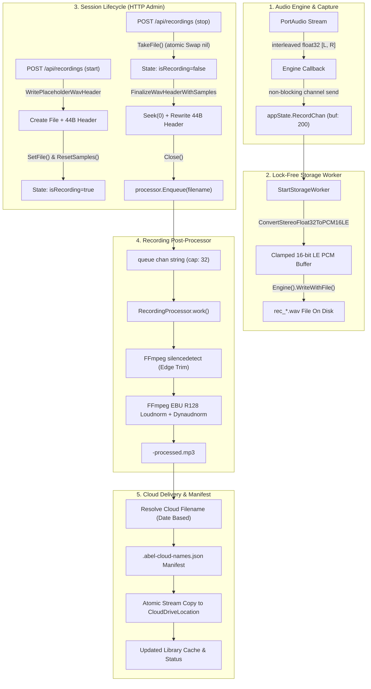

# Comprehensive Audit Guide: Abel Recorder Pipeline

> **Scope**: End-to-end audit procedures, architecture specifications, data invariants, and verification playbooks for the Abel audio recording, header finalization, post-processing normalization, and cloud delivery subsystems.

---

## 1. Executive Architecture & Dataflow

The Abel recording pipeline coordinates real-time lock-free audio capture, atomic file handling, background FFmpeg speech enhancement, and persistent cloud synchronization.



---

## 2. Pipeline Subsystems & Audit Invariants

### Subsystem A: Real-Time Audio Capture & Lock-Free Storage Worker

#### 1. Implementation Files
- [`engine.go`](file:///home/samuelmoses/Workspace/Church/Abel-Audio-Utils/src/backend/lib/audioengine/engine.go): PortAudio stream reader feeding `recordChan`.
- [`storage.go`](file:///home/samuelmoses/Workspace/Church/Abel-Audio-Utils/src/backend/lib/audioengine/storage.go): `StartStorageWorker` and `WriteAudio`.
- [`engine.go` (state)](file:///home/samuelmoses/Workspace/Church/Abel-Audio-Utils/src/backend/lib/state/engine.go): Atomic pointer `atomic.Pointer[os.File]` and sample counters.
- [`pcm.go`](file:///home/samuelmoses/Workspace/Church/Abel-Audio-Utils/src/backend/lib/audioengine/audio_processing/pcm.go): `ConvertStereoFloat32ToPCM16LE`.

#### 2. Core Invariants to Verify
- **Lock-Free Concurrency**: Audio chunk ingestion must never acquire mutexes in the audio path. Writing to disk occurs through `appState.Engine().WriteWithFile(...)`, which loads an `atomic.Pointer[os.File]`.
- **Clamping Safety**: Every `float32` sample must be hard-limited to $[-1.0, +1.0]$ before scaling to $[-32767, +32767]$ int16. Values outside this range must clamp without integer wrapping or distortion.
- **Stereo Byte Alignment**: Each stereo frame consists of $2 \times 2 = 4\text{ bytes}$ (Left 16-bit LE, Right 16-bit LE). An odd sample length chunk must truncate the dangling half-frame rather than produce misaligned byte offsets.
- **Torn File Protection on Stop**: When recording stops, `TakeFile()` atomically swaps the file pointer to `nil`. Storage workers consuming subsequent in-flight channel chunks see `f == nil` and safely no-op without writing to a closed file descriptor.

---

### Subsystem B: WAV Header Generation, Seek Rewriting & Size Clamping

#### 1. Implementation Files
- [`wav.go`](file:///home/samuelmoses/Workspace/Church/Abel-Audio-Utils/src/backend/lib/audioengine/audio_processing/wav.go): `GenerateWavHeader`, `WritePlaceholderWavHeader`, `FinalizeWavHeaderWithSamples`, `FinalizeWavHeader`.
- [`handlers_recordings.go`](file:///home/samuelmoses/Workspace/Church/Abel-Audio-Utils/src/backend/lib/web/handlers_recordings.go): `createRecordingWavFile`, `stopRecordingSession`.

#### 2. 44-Byte Standard RIFF/WAVE Byte Structure
The header must be assembled and written in a single 44-byte atomic block:

| Byte Offset | Field Name | Expected Value | Size |
| :--- | :--- | :--- | :--- |
| `0x00 - 0x03` | `ChunkID` | `"RIFF"` (0x52494646) | 4 bytes |
| `0x04 - 0x07` | `ChunkSize` | $36 + \text{dataSize}$ (uint32 Little Endian) | 4 bytes |
| `0x08 - 0x0B` | `Format` | `"WAVE"` (0x57415645) | 4 bytes |
| `0x0C - 0x0F` | `Subchunk1ID` | `"fmt "` (0x666d7420) | 4 bytes |
| `0x10 - 0x13` | `Subchunk1Size` | `16` (PCM format chunk size) | 4 bytes |
| `0x14 - 0x15` | `AudioFormat` | `1` (Linear PCM) | 2 bytes |
| `0x16 - 0x17` | `NumChannels` | `2` (Stereo) or `ch` | 2 bytes |
| `0x18 - 0x1B` | `SampleRate` | e.g. `44100` or `48000` | 4 bytes |
| `0x1C - 0x1F` | `ByteRate` | $\text{SampleRate} \times \text{NumChannels} \times 2$ | 4 bytes |
| `0x20 - 0x21` | `BlockAlign` | $\text{NumChannels} \times 2$ (e.g. `4` for stereo) | 2 bytes |
| `0x22 - 0x23` | `BitsPerSample` | `16` | 2 bytes |
| `0x24 - 0x27` | `Subchunk2ID` | `"data"` (0x64617461) | 4 bytes |
| `0x28 - 0x2B` | `Subchunk2Size` | $\text{dataSize} = \text{samplesWrote} \times \text{ch} \times 2$ | 4 bytes |

#### 3. Core Invariants to Verify
- **Atomic Creation**: Initial files start with $\text{dataSize} = 0$, $\text{ChunkSize} = 36$.
- **4GB Boundary Protection**: If a multi-hour recording exceeds the 32-bit RIFF limit ($4{,}294{,}967{,}295$ bytes), `FinalizeWavHeader` must clamp `Subchunk2Size` to `0xFFFFFFFF - 36` to prevent signed/unsigned integer wrap corrupting the RIFF container.
- **Seek Validation**: `FinalizeWavHeader` must verify `ws.Seek(0, io.SeekStart)` succeeds before rewriting.

---

### Subsystem C: Post-Processing, Normalization & Trimming

#### 1. Implementation Files
- [`processor.go`](file:///home/samuelmoses/Workspace/Church/Abel-Audio-Utils/src/backend/lib/recording/processor.go): `RecordingProcessor`, `Enqueue`, `work`, `detectEdgeTrimWithContext`, `executeFFmpegEncode`.

#### 2. Processing Pipeline Stages
When `autoPush == true`, the processor executes the following sequential stages:
1. **Validation**: Source file existence, valid extension (`.wav`), non-zero duration via `probeDurationWithContext`.
2. **Analysis (`analyzing`)**:
   - Executes FFmpeg `silencedetect=noise=-60dB:d=1`.
   - Filters boundaries: ignores silence in middle of sermon, strips silence at start ($\le 0.05\text{s}$) if duration $\ge 1\text{s}$, strips tail silence if duration $\ge 2\text{s}$.
   - Safety check: If remaining duration $< 0.5\text{s}$, fallback to full duration.
3. **Encoding (`encoding`)**:
   - Single-pass highpass, dynamic normalization, loudness normalization, and limiter:
     ```
     atrim=start=START:end=END,asetpts=PTS-STARTPTS,highpass=f=80,dynaudnorm=f=150:g=15:p=0.95:m=10,loudnorm=I=-16:LRA=11:TP=-1.5,alimiter=limit=0.95
     ```
   - MP3 codec: Mono (`-ac 1`), 44100 Hz (`-ar 44100`), `libmp3lame`, 96 kbps CBR (`-b:a 96k`).
   - Progress tracking: Reads `-progress pipe:1` standard output (`out_time=...`) to update `job.Progress` and `job.ProcessedSeconds`.
4. **Publishing (`pushing`)**: Moves temporary `.abel-processing-*` to `<stem>-processed.mp3` with file permissions `0644`.

#### 3. Core Invariants to Verify
- **Queue Overflow**: Queue channel capacity is 32. Attempting to enqueue beyond 32 must reject with `ErrQueueFull` (`HTTP 503`).
- **Cancellation Cleanup**: If canceled (`job.Stage == "cancelled"` or context cancellation), temporary encoding files must be unlinked and reserved cloud names immediately freed.

---

### Subsystem D: Cloud Delivery & Filename Resolution

#### 1. Implementation Files
- [`cloud.go`](file:///home/samuelmoses/Workspace/Church/Abel-Audio-Utils/src/backend/lib/recording/cloud.go): Filename parsing, numbered collision handling, manifest persistence.

#### 2. Filename Derivation Rules
Original recordings follow standard timestamp formats (`R_YYYYMMDD-HHMMSS.wav` or `rec_<unix>.wav`):
- Processed MP3: `YYYY-MM-DD_HH-mm-ss.mp3`
- Trimmed MP3: `YYYY-MM-DD_HH-mm-ss-trimmed.mp3`
- Original WAV: `YYYY-MM-DD_HH-mm-ss-original.wav`
- Collisions: Suffix `-2`, `-3` (e.g. `2026-10-10_10-00-00-2.mp3`).

#### 3. Persistent Manifest
- File: `.abel-cloud-names.json` inside `StorageLocation`.
- Atomic writes: Marshals JSON $\to$ writes `.abel-cloud-names-*` temp file $\to$ `Chmod(0644)` $\to$ `Sync()` $\to$ `os.Rename`.
- Reservations survive service restarts to ensure consistent file matching in web library queries.

---

## 3. Step-by-Step Audit Playbook

### Step 1: Automated Race Condition & Concurrency Audit
Run the Go race detector against all recorder-related packages:

```bash
# 1. Audit core audio engine and storage worker
go test -count=1 -v -race ./src/backend/lib/audioengine/...

# 2. Audit post-processing and cloud persistence
go test -count=1 -v -race ./src/backend/lib/recording/...

# 3. Audit HTTP recording endpoints and session state
go test -count=1 -v -race ./src/backend/lib/web/ -run "Recording"
```

> [!IMPORTANT]
> The race detector must complete with zero warnings (`DATA RACE` errors count as critical failure).

---

### Step 2: Binary WAV Header Verification
Capture a sample recording and verify exact byte alignment using `hexdump`:

```bash
# Start a 5-second test recording via API
curl -s -X POST http://localhost:8080/api/recordings \
  -H "Content-Type: application/json" \
  -d '{"action":"start"}'

sleep 5

# Stop the recording
RESP=$(curl -s -X POST http://localhost:8080/api/recordings \
  -H "Content-Type: application/json" \
  -d '{"action":"stop"}')
FILE=$(echo $RESP | jq -r .file)

# Inspect the 44-byte header
hexdump -C -n 44 "$HOME/.config/abel/recordings/$FILE"
```

Verify the output matches:
1. Bytes `00-03`: `52 49 46 46` (`RIFF`)
2. Bytes `08-0B`: `57 41 56 45` (`WAVE`)
3. Bytes `0C-0F`: `66 6d 74 20` (`fmt `)
4. Bytes `14-15`: `01 00` (Audio Format: 1)
5. Bytes `16-17`: `02 00` (Channels: 2)
6. Bytes `24-27`: `64 61 74 61` (`data`)
7. Bytes `28-2B`: Little-endian integer equal to `file_size - 44`.

Validate with `ffprobe`:
```bash
ffprobe -v error -show_entries format=size,duration:stream=codec_name,channels,sample_rate \
  "$HOME/.config/abel/recordings/$FILE"
```

---

### Step 3: Loudness Normalization & Audio Quality Audit
Audit the generated MP3 file for EBU R128 loudness compliance:

```bash
MP3_FILE="${FILE%.wav}-processed.mp3"

# Verify audio stream properties
ffprobe -v error -select_streams a:0 -show_entries stream=codec_name,channels,sample_rate,bit_rate \
  -of default=noprint_wrappers=1:nokey=1 "$HOME/.config/abel/recordings/$MP3_FILE"
# Expected output:
# mp3
# 44100
# 1
# 96000

# Audit integrated loudness with ffmpeg ebur128 filter
ffmpeg -nostats -i "$HOME/.config/abel/recordings/$MP3_FILE" \
  -filter_complex ebur128=peak=true -f null - 2>&1 | grep "Integrated loudness:"
# Target: ~ -16.0 LUFS (+/- 1.0 LUFS)
```

---

### Step 4: Edge Case & Fault Injection Testing

| Test Case | Procedure | Expected Behavior | Pass Criteria |
| :--- | :--- | :--- | :--- |
| **Abrupt Stop During Write** | Send high volume chunks to `recordChan`, concurrently invoke `stop` action. | `TakeFile` atomically detaches file. Remaining chunks in channel safely drop. | Zero panics, zero writes to closed fd, valid WAV header. |
| **Zero Sample Recording** | Start recording and immediately stop without delay ($< 10\text{ms}$). | `samplesWrote == 0`. Final header has `dataSize == 0`. | WAV file valid 44 bytes, not corrupted. |
| **Duplicate Cloud File** | Place an existing file in `cloud/` with name `YYYY-MM-DD_HH-mm-ss.mp3`. | Next push generates `YYYY-MM-DD_HH-mm-ss-2.mp3`. | No overwrite of existing cloud file. Manifest records reservation. |
| **FFmpeg Failure / Missing Tool** | Rename `ffmpeg` temporarily and invoke `ProcessRecording`. | Job updates to `failed` stage. Library reflects error string. | System stays responsive, `500` error trapped, no zombie processes. |
| **Queue Saturation** | Submit 35 simultaneous jobs to `processor.Enqueue`. | First 32 jobs queue (`queued`). Next 3 jobs fail with `ErrQueueFull`. | Return `HTTP 503` for jobs $>32$. |

---

## 4. Auditor Checklist

- [ ] **Lock-Free Safety**: No locks held during `WriteAudio` or buffer clamping.
- [ ] **Channel Capacity**: `recordChan` buffer is sized to withstand disk I/O latency spikes (min 200 chunks).
- [ ] **Memory Allocation**: PCM conversions reuse slice capacities or batch writes where appropriate.
- [ ] **WAV Header Standard**: Magic strings `RIFF`, `WAVE`, `fmt `, `data` at byte offsets 0, 8, 12, 36.
- [ ] **Seek Position**: Rewind seeks to offset 0 before rewriting finalized header.
- [ ] **4GB Boundary**: Header clamp logic covers `uint32` overflow on files $> 4\text{GB}$.
- [ ] **EBU R128 Loudness**: Integrated loudness reaches $-16.0\text{ LUFS}$, true peak $\le -1.5\text{ dBTP}$.
- [ ] **Silence Boundaries**: Middle-of-speech silence is preserved; boundary silence trimmed cleanly.
- [ ] **Cloud Manifest**: `.abel-cloud-names.json` written atomically via temp file rename.
- [ ] **Telemetry Metrics**: Latency histogram `telemetry.RecordingLatency` records execution duration.
